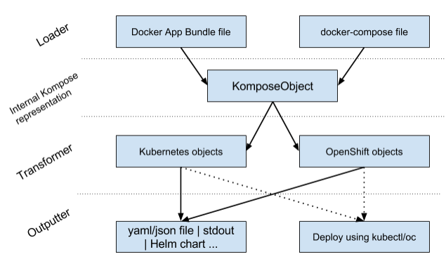

# Kompose - Internal Design

Kompose have been broken to 3 stages: Loader, Transformer and Outputter. Each Stage should have well defined interface so it is easy to write new Loader, Transformer or Outputters and plug it in. Currently Loader and Transformer interfaces are already there.



## Loader

Loader reads input file (now `kompose` supports [Docker Compose](https://docs.docker.com/compose) v1, v2 and [Docker Distributed Application Bundle](https://blog.docker.com/2016/06/docker-app-bundle/) file) and converts it to KomposeObject.

Loader is represented by a Loader interface:
 
```console
type Loader interface {
      LoadFile(file string) kobject.KomposeObject
}
```

Every loader “implementation” should be placed into `kompose/pkg/loader` (like compose & bundle). More input formats will be supported in future. You can take a look for more details at:

* kompose/pkg/loader.
* kompose/pkg/loader/bundle.
* kompose/pkg/loader/compose.

## KomposeObject

`KomposeObject` is Kompose internal representation of all containers loaded from input file. First version of `KomposeObject` looks like this (source: [kobject.go](https://github.com/skippbox/kompose/blob/master/pkg/kobject/kobject.go)):

```console
// KomposeObject holds the generic struct of Kompose transformation
type KomposeObject struct {
	ServiceConfigs map[string]ServiceConfig
}

// ServiceConfig holds the basic struct of a container
type ServiceConfig struct {
	ContainerName string
	Image         string
	Environment   []EnvVar
	Port          []Ports
	Command       []string
	WorkingDir    string
	Args          []string
	Volumes       []string
	Network       []string
	Labels        map[string]string
	Annotations   map[string]string
	CPUSet        string
	CPUShares     int64
	CPUQuota      int64
	CapAdd        []string
	CapDrop       []string
	Entrypoint    []string
	Expose        []string
	Privileged    bool
	Restart       string
	User          string
}
```

## Transformer

Transformer takes KomposeObject and converts it to target/output format (at this moment, there are sets of kubernetes/openshift objects). Similar to `Loader`, Transformer is represented by a Transformer interface:

```console
type Transformer interface {
     Transform(kobject.KomposeObject, kobject.ConvertOptions) []runtime.Object
}
```

If you wish to add more providers which contain different kind of objects, transformer would be the place to look into. At this moment Kompose supports Kubernetes (by default) and Openshift providers. More details at:

* kompose/pkg/transformer
* kompose/pkg/transformer/kubernetes
* kompose/pkg/transformer/openshift

## Outputter

Outputter takes Transformer result and executes given action. For example action can be displaying result to stdout or directly deploying artifacts to Kubernetes/OpenShift.